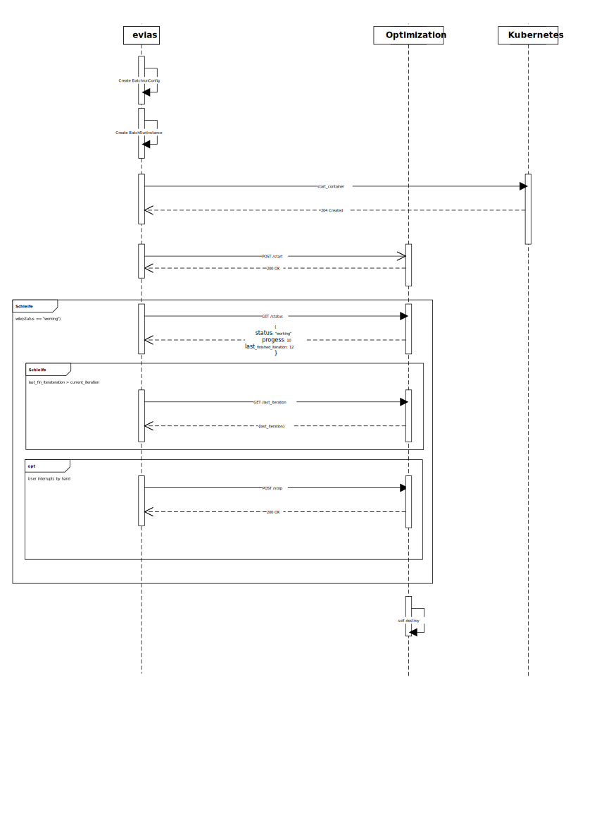

# Wiki

* [Commandline](commandline.md)
* [Programming-Guidelines](programming-guidelines.md)
* [REST communication between Optimization and Webapp](rest.md)
* [Testing-Guidelines](testing.md)
* [Troubleshooting](troubleshooting.md)
* [gitlab runner](gitlab-runner.md)
* [Home](home.md)

## REST Communication between Otpimization and Webapp

# UML Sequence of Communication

## Original Visio File
[rest_communication_evias_optimization.vsdx](rest_communication_evias_optimization.vsdx)

